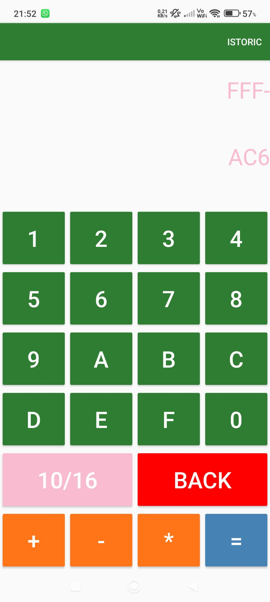
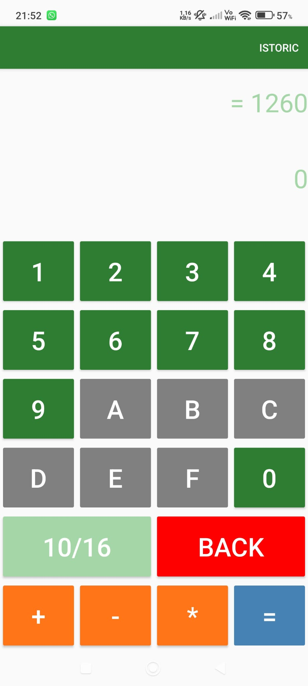
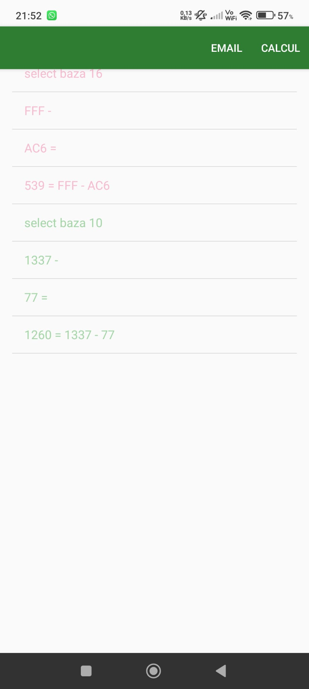
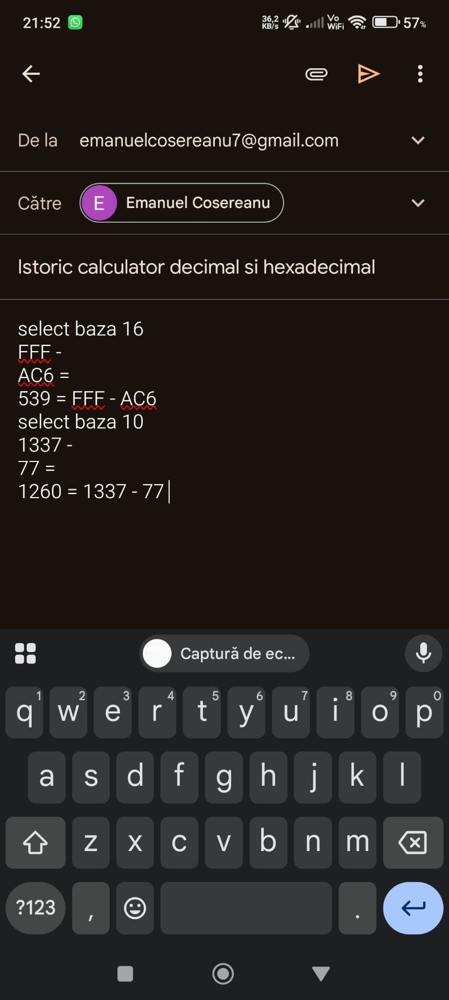

# Android Decimal-Hexadecimal Calculator

This mobile application, developed in Kotlin, is designed to perform mathematical operations in both decimal (Base 10) and hexadecimal (Base 16) numeral systems. The project focuses on dynamic data conversion, state management, and providing a seamless user experience across different UI orientations.

### Key Features
*   Dual-Base Support: Allows addition, subtraction, and multiplication in both decimal and hexadecimal systems.
*   Dynamic Conversion: When switching bases, the current input and results are automatically converted to the new base without interrupting the calculation flow.
*   Context-Aware UI: Hexadecimal buttons (A-F) are programmatically enabled or disabled based on the active base to ensure data integrity and prevent invalid inputs.
*   Interactive History System:
    *   Automatic logging of all performed operations.
    *   Data Recovery: Users can select any item from the history to re-import the value into the main calculator.
    *   Visual Formatting: Distinct color schemes are used to differentiate calculations performed in different bases.
*   Data Export: Built-in integration to export the complete calculation history via email.
*   Adaptive Layout: Fully optimized UI for both Portrait and Landscape orientations.
*   Reliability: Implements character limits for input fields and handles activity state persistence to prevent data loss during screen rotations.

### Technologies and Tools
*   Programming Language: Kotlin.
*   UI Framework: Android SDK with XML layouts and Material Design 3 components.
*   Key Components:
    *   AppCompatActivity for lifecycle management.
    *   ActivityResultLauncher for inter-activity communication.
    *   ListView and ArrayAdapter for managing complex historical data.
    *   SpannableString for advanced text formatting within lists.
*   Core Logic: BigInteger for high-precision arithmetic and base conversions; Intent system for external application integration.

### Implementation and Architecture
*   State Management: Uses onSaveInstanceState and onRestoreInstanceState to ensure a continuous user experience during configuration changes.
*   Smart Reset Logic: The application intelligently resets input fields when a new digit is entered following a result, unless an operator is chosen to continue the calculation.
*   Structure: Clear separation of concerns between the main calculation logic (MainActivity), data management (HistoryData), and history visualization (HistoryActivity).

### Further Details
For more details regarding technical requirements, system architecture, and detailed code explanations, please refer to the  [documentation](https://github.com/emanuelco07/Android_Decimal_Hexadecimal_Calculator/blob/main/Cosereanu_Emanuel_Calculator_decimal_hexadecimal.pdf) in Romanian available in this repository (attached PDF file).

## Visual Preview
In this section, you can see the application interface and its responsive design.

